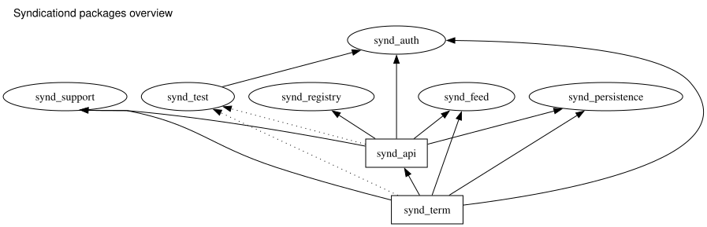

# Contributing

## Development

syndicationd uses [Nix](https://nixos.org/) to prepare the development and CI
toolchain. For installing Nix, refer to the
[Nix install documentation](https://github.com/DeterminateSystems/nix-installer).

Enter the development shell before running the project commands:

```sh
nix develop
```

### Overview of Packages



| Package             | Description                                  |
| ---                 | ---                                          |
| `synd_support`     | Shared support and observability utilities  |
| `synd_feed`        | RSS/Atom feed lib                           |
| `synd_auth`        | Authentication lib                          |
| `synd_registry`    | Feed registry domain lib                    |
| `synd_persistence` | Durable storage adapters                    |
| `synd_api`         | GraphQL API server                          |
| `synd_term`        | TUI and CLI app                             |
| `synd_test`        | Test support lib                            |

### Running Locally

The normal development path is the in-process local backend:

```sh
just run-local
```

This is equivalent to running `synd` with `--local`; it starts the TUI and an
in-process `synd-api` backed by a local SQLite database.

When working on the standalone API server, use two terminals:

```sh
just run api
just run term -- --backend remote
```

`just run api` starts `synd-api` with SQLite and local TLS certificates. The
`just run term` recipe sets `SYND_ENDPOINT` to the local API endpoint used by
the API recipe.

List available recipes with:

```sh
just
```

### Updating GraphQL Schema

If you update the `synd-api` GraphQL schema, first run a local API with
introspection enabled:

```sh
just run api
```

Then update the schema used by `synd-term` and regenerate the client code:

```sh
just graphql schema
just graphql generate
```

`just graphql schema` reads `GH_PAT` when the introspection request needs an
authorization header.

## Testing

* `just lint`: run typo and clippy checks
* `just test`: run unit and integration tests
* `just test unit`: run unit tests with nextest
* `just test integration`: run integration tests
* `just bench`: run benchmarks
* `just bench flamegraph`: generate a flamegraph

For `synd-term` changes that touch feature-gated code, run both:

```sh
cargo clippy -p synd-term -- -D warnings
cargo clippy -p synd-term --all-features -- -D warnings
```

## Commit Message

Commit message should follow [conventional commit](https://www.conventionalcommits.org/en/v1.0.0/).  
type is one of the following.

| commit type | description                         |
|-------------|-------------------------------------|
| `feat`      | add a new feature                   |
| `style`     | tui style                           |
| `fix`       | bug fix                             |
| `perf`      | performance improvement             |
| `doc`       | documentation                       |
| `ci`        | continuous Integration and delivery |
| `refactor`  | refactoring                         |
| `chore`     | catch all                           |

Use the scope without the `synd` prefix from the crate name.
For example, when making changes to `synd_term`, the commit message should be `feat(term): add new feature`.
The commit will be used to generate the CHANGELOG for each crate.

## For Maintainers

For information about CI, refer to [ci.md](/docs/ci.md).

### Release Flow

To perform a release, run `just synd <package> release (patch|minor|major) [--execute]`.
For example, to release version v0.2.0 of `synd-api` when it is currently at version v0.1.0, run `just synd api release minor`.

This task will be executed in dry-run mode, allowing you to review the CHANGELOG generation and replacement processing. Once you have confirmed that there are no issues, return the command with the `--execute` flag.  

This process will publish the package to crates.io and push the git tag.  
The git tag will trigger the release workflow, which will create a GitHub release.

### Update rust version

The project's rust version is managed in the [rust-toolchain.toml](./rust-toolchain.toml).  
If you encounter the following error after upgrading the Rust version and running `nix develop`:

```
error: Stable 1.x.y is not available  
```

In that case, execute `just nix update rust-overlay`.

## License

By contributing to `syndicationd`, you agree that your contributions will be dual-licensed under
the terms of the [`LICENSE-MIT`](./LICENSE-MIT) and [`LICENSE-APACHE`](./LICENSE-APACHE) files in the
root directory of this source tree.
