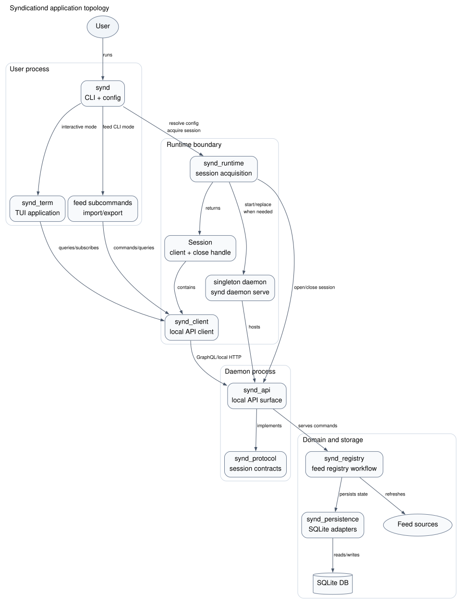

# Contributing

## Development

syndicationd uses [Nix](https://nixos.org/) to prepare the development and CI
toolchain. For installing Nix, refer to the
[Nix install documentation](https://github.com/DeterminateSystems/nix-installer).

Enter the development shell before running the project commands:

```sh
nix develop
```

### Application Topology



This diagram describes runtime interaction, not crate dependencies. For normal
development and user workflows, `synd` is the composition root. It resolves
CLI/configuration, asks `synd_runtime` to acquire a session, then either starts
`synd_term` for interactive use or runs a feed CLI subcommand.

`synd_runtime` owns the local daemon lifecycle. It resolves a runtime instance
from the configured SQLite database, serializes daemon startup with an instance
lock, starts or replaces the singleton daemon when needed, connects over the
platform runtime endpoint, and opens/closes protocol sessions. Platform-specific
placement and transport details should stay behind the `Runtime`/`Session` API.

A successful session gives the application a configured `synd_client::Client`.
The TUI and runtime-backed CLI commands use that client to talk to the local API;
they should not start local API services or manage runtime sessions directly.

`synd_api` owns the daemon's API surface. It implements session endpoints and the
GraphQL/local API used by `synd_client`. Registry behavior stays in
`synd_registry`, and SQLite storage concerns stay behind `synd_persistence`.

`synd_protocol` owns the small wire contracts shared by the client, API server,
and runtime daemon. Put session-open/session-close payloads, capability
negotiation, and other cross-process protocol contracts here instead of in
`synd_client` or `synd_api`.

### Workspace Packages

| Package             | Description                                                       |
| ---                 | ---                                                               |
| `synd`             | Binary composition root for CLI, configuration, and runtime setup |
| `synd_support`     | Shared support helpers and observability utilities                |
| `synd_feed`        | Feed model, retrieval, and parsing                                |
| `synd_auth`        | Authentication helpers and auth-domain types                      |
| `synd_protocol`    | Shared wire contracts for client/server session negotiation       |
| `synd_registry`    | Feed registry domain, subscription commands, and event processors |
| `synd_persistence` | SQLite adapters for registry state and event transactions         |
| `synd_api`         | GraphQL/local API server and daemon session endpoints             |
| `synd_client`      | Typed API client, GraphQL operations, and session protocol calls   |
| `synd_runtime`     | Runtime session acquisition and singleton daemon lifecycle        |
| `synd_term`        | TUI application and event loop                                    |
| `synd_test`        | Test support utilities                                            |

### Running Locally

The normal development path uses the local daemon-backed runtime:

```sh
just run term
```

This starts the `synd` binary, which acquires a runtime session by attaching to
or starting the local singleton daemon and then starts the TUI.

List available recipes with:

```sh
just
```

### Updating GraphQL Schema

If you update the `synd-api` GraphQL schema, update the schema used by
`synd-client` and regenerate the client code:

```sh
just graphql schema
just graphql generate
```

`just graphql schema` reads `GH_PAT` when the introspection request needs an
authorization header.

## Testing

* `just lint`: run typo and clippy checks
* `just test`: run unit and integration tests
* `just test unit`: run unit tests with nextest
* `just test integration`: run integration tests
* `just bench`: run benchmarks
* `just bench flamegraph`: generate a flamegraph

For `synd-term` changes that touch feature-gated code, run both:

```sh
cargo clippy -p synd-term -- -D warnings
cargo clippy -p synd-term --all-features -- -D warnings
```

## Commit Message

Commit message should follow [conventional commit](https://www.conventionalcommits.org/en/v1.0.0/).  
type is one of the following.

| commit type | description                         |
|-------------|-------------------------------------|
| `feat`      | add a new feature                   |
| `style`     | tui style                           |
| `fix`       | bug fix                             |
| `perf`      | performance improvement             |
| `doc`       | documentation                       |
| `ci`        | continuous Integration and delivery |
| `refactor`  | refactoring                         |
| `chore`     | catch all                           |

Use the scope without the `synd` prefix from the crate name.
For example, when making changes to `synd_term`, the commit message should be `feat(term): add new feature`.
The commit will be used to generate the CHANGELOG for each crate.

## For Maintainers

For information about CI, refer to [ci.md](/docs/ci.md).

### Release Flow

To perform a release, run `just synd <package> release (patch|minor|major) [--execute]`.
For example, to release version v0.2.0 of `synd-api` when it is currently at version v0.1.0, run `just synd api release minor`.

This task will be executed in dry-run mode, allowing you to review the CHANGELOG generation and replacement processing. Once you have confirmed that there are no issues, return the command with the `--execute` flag.  

This process will publish the package to crates.io and push the git tag.  
The git tag will trigger the release workflow, which will create a GitHub release.

### Update rust version

The project's rust version is managed in the [rust-toolchain.toml](./rust-toolchain.toml).  
If you encounter the following error after upgrading the Rust version and running `nix develop`:

```
error: Stable 1.x.y is not available  
```

In that case, execute `just nix update rust-overlay`.

## License

By contributing to `syndicationd`, you agree that your contributions will be dual-licensed under
the terms of the [`LICENSE-MIT`](./LICENSE-MIT) and [`LICENSE-APACHE`](./LICENSE-APACHE) files in the
root directory of this source tree.
