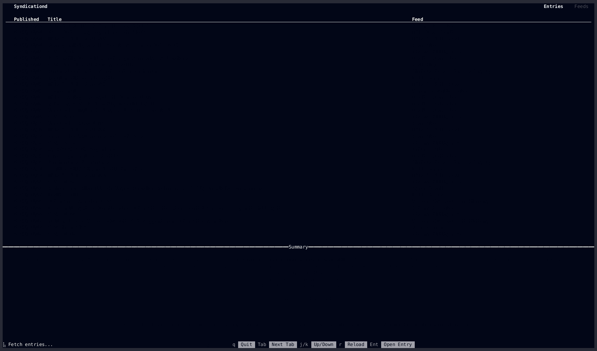

# Syndicationd

[](https://github.com/ymgyt/syndicationd/actions/workflows/ci.yaml)



Syndicationd is a TUI feed viewer, based on [feed-rs](https://github.com/feed-rs/feed-rs) and [ratatui](https://github.com/ratatui-org/ratatui).

## Development

```sh
# Setup local environment
nix develop

# Run check
just check
```

## License

This project is available under the terms of either the [Apache 2.0 license](./LICENSE-APACHE) or the [MIT license](./LICENSE-MIT).
